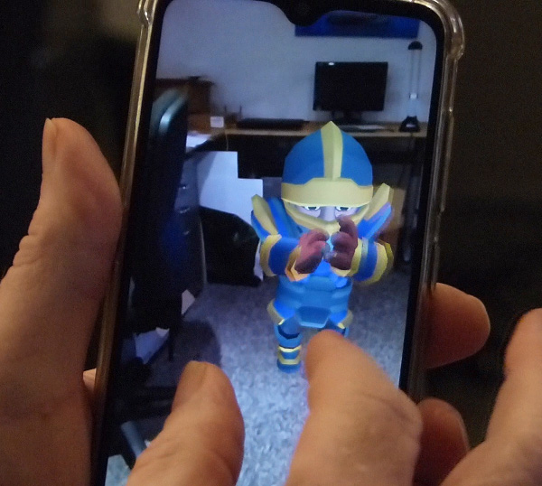

# XRGestures
Add touch gestures to a WebXR AR app without using dom-overlay.



## You-Tube tutorial
- [XRGestures tutorial](https://youtu.be/2OLP4ZEYTUI)

## Get Started
Add XRGestures.js to your project

Create a gestures object, it needs a Three.JS WebGLRenderer object as a parameter
```
const gestures = new XRGestures( renderer );
```

Add a tap event
```
gestures.addEventListener( 'tap', (ev)=>{
    console.log( 'tap' ); 
});
```

Add a doubletap event
```
gestures.addEventListener( 'doubletap', (ev)=>{
    console.log( 'double tap' ); 
});
```

Add a press event. A touch hold over 0.5 seconds
```
gestures.addEventListener( 'press', (ev)=>{
    console.log( 'press' );    
});
```

Add a swipe event.
```
//ev attributes
//direction: string value, up or down
gestures.addEventListener( 'swipe', (ev)=>{
    console.log(`swipe ${ev.direction}` );
});
```
        
Add a pan event. This event gets an initialise property for the first callback.
```
//ev attributes
//initialise: only exists for the first callback
//delta: Vector3 distance moved since previous callback
gestures.addEventListener( 'pan', (ev)=>{
    if (ev.initialise !== undefined){
        console.log('pan: initialise');
    }else{
        console.log()`pan x:${ev.delta.x.toFixed(3)}, y:${ev.delta.y.toFixed(3)}, x:${ev.delta.z.toFixed(3)}` );
	}
);
```

Add a pinch event. This event gets an initialise property for the first callback.
```
//ev attributes
//initialise: only exists for the first callback
//delta: distance moved since previous callback
//scale: current distance between touches/start distance between touches
gestures.addEventListener( 'pinch', (ev)=>{
    if (ev.initialise !== undefined){
        console.log('pinch: initialise');
    }else{
        console.log(`pan x:${ev.delta.x.toFixed(3)}, y:${ev.delta.y.toFixed(3)}, x:${ev.delta.z.toFixed(3)}` );
	}
);
```

Add a rotate event. This event gets an initialise property for the first callback.
```
//ev attributes
//initialise: only exists for the first callback
//theta: radian angle change from first call
gestures.addEventListener( 'rotate', (ev)=>{ 
	if (ev.initialise !== undefined){
		console.log('rotate: initialise');
	}else{
		console.log(`rotate ${ev.theta.toFixed(3)}`);
	}
});
```

An online example is available [here](https://niksgames.com/webxr/XRGestures/complete/)

## Links
- [My courses](http://niklever.com/courses)
- [FB Three.JS Group](https://www.facebook.com/groups/nikthreejs)
- [Twitter](https://twitter.com/NikLever)
- [YouTube Channel](https://youtube.com/c/NikLever)
- [nik.j.lever@gmail.com](mailto:nik.j.lever@gmail.com)
